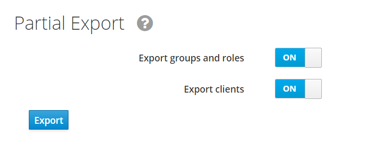
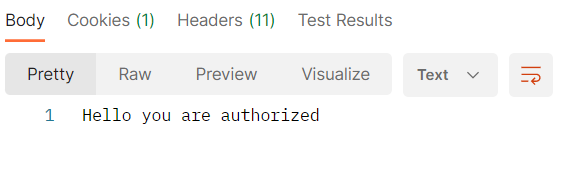
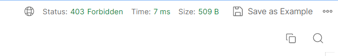
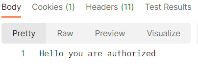
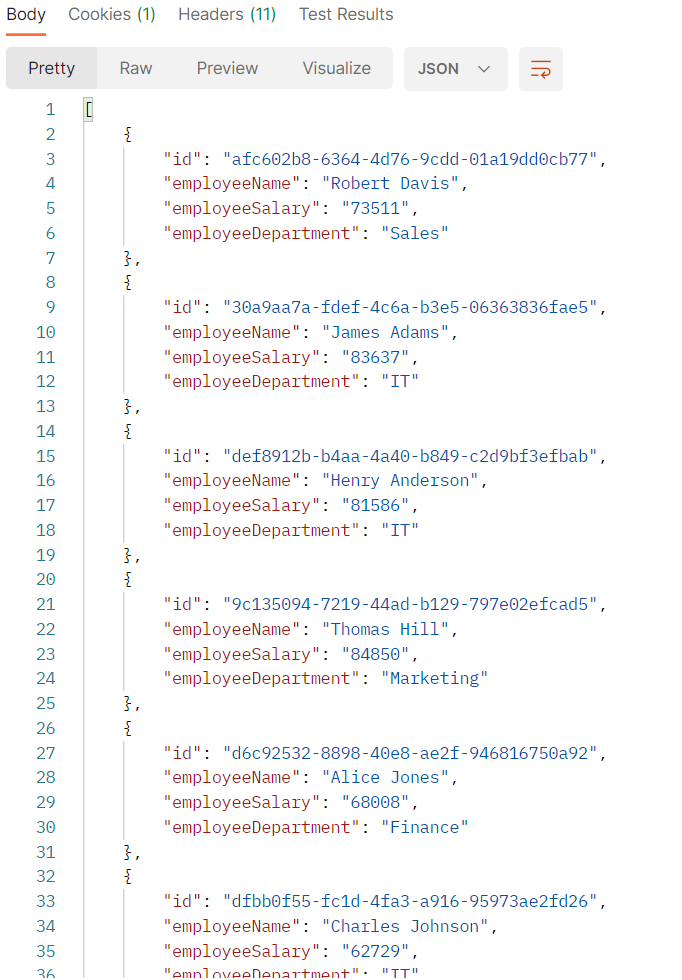

# How to launch project

## Preparations
Install docker machine on your local machine using one of proposed guide by this link: https://docs.docker.com/engine/install/

## Launch project

Go to root directory of project in terminal/command line and execute this command
```bash
docker-compose up --build
```
It will pull Keycloak image, build image of project and run it simultaneously in container.
App will be running on 8081 port and Keycloak on 8080.

## Working with project

Download Postman to perform HTTP requests.
Select version for your system and download here https://www.postman.com/downloads/postman-agent/

After starting Postman import collection using this link https://api.postman.com/collections/15826172-a989b383-a314-4aed-9990-56674dac1887?access_key=PMAT-01H7W1HH74ED4XJQ50NJ7DTJE7

`OAuthn2 token` folder commands are responsible for acquiring access token
`Service` folder commands are responsible for requests to Spring Boot app.

To acquire token you need to copy `Get token` request, paste to you browser and perform Sign In process in Keycloak server
Then after successful sign in, copy `code` part from URL.
Paste copied part into `Get access token` request and execute it in Postman.
In response, you will see data about access token that you have acquired.
`access_token` value will be copied to environment variable and will be used in requests to Spring Boot App.

# TASK 1
## Configuring Keycloak
### Step 1. Logging into Keycloak
Go by this link http://localhost:8080/auth/ to Keycloak console<p>
<p>

Click `Administration Console` and you will be redirected to login page<p>
<p>

Admin user is already predefined, so enter: <p>
`Username: admin` <p>
`Password: admin` <p>

### Step 2. Create Keycloak realm
On left side menu, hover over `Master` realm and click `Add realm` <p>
<p>

Enter name of realm and verify that `Enabled` is `On` <p>
 <p>
After this you will be redirected to your realm page.<p>
You should see at the top of menu name of your realm.<p>
<p>
### Step 3. Create and configure client
Go to `Clients` page. Look for button at menu. You will be redirected, and you will see base clients.<p>
 <p>
Click Create button and fill `ClientID` field and click `Save`. <p>
 <p>
After this you will be redirected to your client page. <p>
Verify that `Enabled`, `Standard Flow Enabled`, `Direct Access Grants Enabled` and `Backchannel Logout Session Required` are turned on.  
All other sliders are disabled. <p>
Change `Client Protocol` to `openid-connect` and `Access Type` to `confidential`. <p>
Into `Valid Redirect URIs` enter URI that will handle URI for accessing code for token and click `+` to add it.<p>
Into `Web Origins` enter URI of your service and click `+` to add it.<p>
Complete configuration looks like this.<p>
<p>
<p>
After configuration click `Save`.
### Step 4. Create new role
To create new role go to `Roles` tab and click `Add Role` button.<p>
<p>
Enter role name and some description and click save. <p>
 <p>
### Step 5. Create and configure User
Go to `Users` tab and click `Add user` button. Enter `Username` and all other information that you want and click `Save`.<p>
<p>
Go to `Credentials` tab and define `Password`. I propose to set `Temporary` slider to Off to prevent redefining password.
Click Set Password button and agree in popup window<p>
 <p>
After this password is set up successfully. If you see after creation that fields are empty and `Temporary` is On, it's completely fine.<p>
 <p>
Go to `Role Mappings `tab. <p>
<p>
Click on your role and click `Add selected`. <p>
 <p>

### Step 6. Configure Custom Attributes
Go to `Users`, select your user, click `Attributes` tab.<p>
 <p>
Here you will define custom attribute.<p>
Enter key name department, value for it and click `Add`. Enter one of this `HR, Sales, Marketing, Finance, IT` to work with predefined data.<p>
<p>
Click Save to complete adding attribute. <p>
Go to `Clients` and select your client, click `Mappers` and `Create button`.<p>
In `Mapper Type` select `User Attribute`. Enter any mapper name.
In `User Attribute` and `Token Claim Name` enter name of attribute that you have define previously for your user.
Switch off all sliders except of `Add to access token` and click `Save`<p>
<p>

### Step 7. Acquire Access Token
Run Postman program, import collection using this link:
https://api.postman.com/collections/15826172-a989b383-a314-4aed-9990-56674dac1887?access_key=PMAT-01H7W1HH74ED4XJQ50NJ7DTJE7
and you can start testing application using existing collection. <p>

`OAuthn2 token` folder commands are responsible for acquiring access token
`Service` folder commands are responsible for requests to Spring Boot app.

Firstly go to `Get code` request and change in URI fields:
* `realm` - name of your realm
* `client_id` - name of your client
* `redirect_uri` - redirect URI that you defined in client config

In `Get access token` request change all from previous and additionally `client_secret`.<p>
Go to your realm -> Client -> Credentials and copy value in `Secret` field. If it is hidden click `Regenerate Secret`. <p>
Also you can define your personal `state` value.<p>

Now you can try to log in into using user that you have created.
To acquire token you need to copy `Get code` request, paste to you browser and perform Sign In process in Keycloak server.

Then after successful sign in, copy `code` part from URL.
Paste copied part into `Get access token` request and execute it in Postman.
In response, you will see data about access token that you have acquired.
If you got response with `access_token` field, you have logged in successfully.

# TASK 2
## Preparations
### Update iam-keycloak-poc-realm.json file
Go to Keycloak console and in left menu find `Export`. <p>
Select all sliders click `Export` and confirm export. <p>
 <p>
Open file and copy all json to `iam-keycloak-poc-realm.json` file in project.<p>
Now all configurations from previous task is imported into this. <p>

## Configuring role based access to endpoints
### Configuring endpoints
### Step 1. Add new dependency into gradle file
To work with Spring Security using Keycloak you need to add this dependency
(`'org.springframework.boot:spring-boot-starter-oauth2-resource-server'`)
to `gradle.build` file.

### Step 2. Create WebSecurity class
Create new class `WebSecurity`.
Add annotations `@Configuration` and `@EnableWebSecurity`. <p>
`@EnableWebSecurity` annotation works only for `@Configuration` class.
It allows to configure Spring Security configuration defined in any `WebSecurityConfigurer` class.<p>

### Step 3. Configure role based access
In Spring Security versions 3.0.0 and above you need to define `@Beans` with needed configurations.<p>
For role based configuration you need to define `SecurityFilterChain` bean. <p>
For role based configuration you also need converter for Keycloak roles. <p>
Here is code for converter class:

    private static class KeycloakRoleConverter implements Converter<Jwt, Collection<GrantedAuthority>> {

        @Override
        public Collection<GrantedAuthority> convert(Jwt jwt) {
            Map<String, Object> realmAccess = (Map<String, Object>) jwt.getClaims().get("realm_access");

            if (realmAccess == null || realmAccess.isEmpty()) {
                return new ArrayList<>();
            }

            Collection<GrantedAuthority> returnValue = ((List<String>) realmAccess.get("roles"))
                    .stream().map(roleName -> "ROLE_" + roleName)
                    .map(SimpleGrantedAuthority::new)
                    .collect(Collectors.toList());

            return returnValue;
        }

    }
In this class you override base `convert` function of class `Converter`.<p>
It allows to manipulate with converting role by you own.<p>
The main difference between simple JWT converter and this is that you need to get all data
from `realm_access` key.<p>
Also as we are using role based approach we need to match with`ROLE_` prefix in role name. <p>

Now we can define `SecurityFilterChain` bean<p>
Here is code example:

    @Bean
    public SecurityFilterChain filterChain(HttpSecurity http) throws Exception {
        JwtAuthenticationConverter jwtAuthenticationConverter = new JwtAuthenticationConverter();
        jwtAuthenticationConverter.setJwtGrantedAuthoritiesConverter(new KeycloakRoleConverter());

        http.authorizeHttpRequests((requests) -> requests
                .requestMatchers("/users/welcome")
                .permitAll()
                .requestMatchers("/employees/search", "/some/manager/access")
                .hasAnyRole("manager", "other_important_role")
        ).oauth2ResourceServer(oauth2 -> oauth2
                .jwt()
                .jwtAuthenticationConverter(jwtAuthenticationConverter)
        );

        return http.build();
    }

Firstly we define `JwtAuthenticationConverter` to convert JWT that comes from Keycloak.<p>
Then using `HttpSecurity` we define all what type of access each endpoint have. <p>
For example `/users/welcome` endpoint can access anybody as it has `permitAll()` grant.<p>
For `/employees/search` there is direct configuration that this endpoint can only
access users that have role `manager`. Also `requestMatchers()` and `hasAnyRole()` functions
allow you to define any number of endpoints and roles. Look at the example above.
After configuring role based access to endpoint you need to configure OAuth2 resource server support
and define how to work with JWT token.<p>
As you previously define how to work with JWT from Keycloak you need to define converter for OAuth2
in `jwtAuthenticationConverter()`.

### Step 4. Final configurations to communicate with Keycloak
In `application.yaml` file you need to define where jwt token will be verified<p>

    security:
      oauth2:
        resource-server:
          jwt:
            jwk-set-uri: ${KEYCLOAK_JWK_SET_URI:http://localhost:8080/auth/realms/iam-keycloak-poc/protocol/openid-connect/certs}

You can find this URI using this URL: http://{keycloak_host:keycloak_port}/auth/realms/{your_realm_name}/.well-known/openid-configuration <p>
Replace `{keycloak_host:keycloak_port}` with your host and port and `{your_realm_name}` with your realm name. <p>
There you can see different URI for JWT validation. Any of them can be used in configuration. <p>
In our approach we are using jwk URI, so find your JWK URI by key `jwks_uri` and copy it into
`jwk-set-uri` property in `application.yaml`. <p>
Also if you run your app via `docker-compose up` command to control your jwk URI you need to define environment key in `docker-compose.yaml` file for `iam-app` container
as `KEYCLOAK_JWK_SET_URI=http://keycloak:8080/auth/realms/iam-keycloak-poc/protocol/openid-connect/certs`. <p>
Notice that for working host we are using `keycloak`, the name of container in with Keycloak is running.<p>

### Step 5. Testing using Postman.
Firstly let's create new user that doesn't have `manager` role. Use previous guide to do it.
Log in using new user. Try to call both API endpoints of service and you should see
this result: <p>
 <p>
 <p>
After you verified that new user cannot access to `Get All Employees By Regex Name`
endpoint try to log in using manager user. and you should see this result: <p>
 <p>
 <p>

If everything is working as shown on pictures, then you have configured all successfully.
