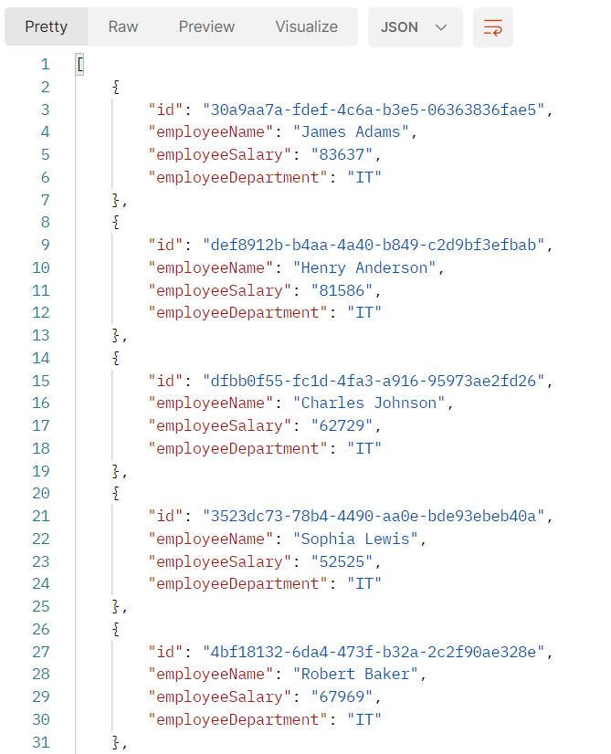

# Retrieve custom attribute from JWT token and use it for data filtering

## Retrieve custom attribute from JWT token
### Step 1. Create helper class to work with Spring SecurityContext
In `service` package create class `SecurityContextHelper`. 

This class will support working with different `SecurityContext` elements. 
In our case it will retrieve custom attribute.

### Step 2. Implement retrieving of custom attribute 
In our case we will retrieve only `department` attribute so lets create a `static` function for it.

    public static String getDepartment() {
        final var jwtToken = SecurityContextHolder.getContext().getAuthentication();
        final var credentials = (Jwt)jwtToken.getCredentials();

        return (String) credentials.getClaims().get("department");
    }

This function is retrieving `Authentication` JWT token from Spring `SecurityContext`.
After this you retrieve JWT token from Authentication Context. 
Then you retrieve JWt token claims map. In this map you have all your JWT token key-values.
As we need custom attribute that you defined earlier as `department` you need to get it from the map.

To investigate how your JWT token looks like you can copy it from Postman and check it
on this site https://jwt.io/.
In payload section you will see all information about authentication, user, user privileges
and custom attributes that are assigned on him.

Here is example payload:

    {
        "exp": 1692265242,
        "iat": 1692264942,
        "auth_time": 1692264892,
        "jti": "af482a33-64e1-475c-8b98-a3b30469c1b6",
        "iss": "http://localhost:8080/auth/realms/iam-keycloak-realm",
        "aud": "account",
        "sub": "ab4d6c45-c341-43f6-9799-7fccda862ee5",
        "typ": "Bearer",
        "azp": "iam-user-data",
        "session_state": "b38028f7-73e1-431d-bee4-85c35444d1af",
        "acr": "1",
        "allowed-origins": [
        "http://localhost:8080"
        ],
        "realm_access": {
        "roles": [
        "manager",
        "default-roles-iam-keycloak-realm",
        "offline_access",
        "uma_authorization"
        ]
        },
        "resource_access": {
        "account": {
        "roles": [
        "manage-account",
        "manage-account-links",
        "view-profile"
        ]
        }
        },
        "scope": "openid email profile",
        "sid": "b38028f7-73e1-431d-bee4-85c35444d1af",
        "email_verified": false,
        "name": "John Doe",
        "preferred_username": "johndoe",
        "given_name": "John",
        "department": "IT",
        "family_name": "Doe",
        "email": "johndoe@email.com"
    }

As you  can see there is `department` key with `IT` values. 
It is previously defined custom attribute.

## Filter data from database by department
### Step 1. Update JPA @Query

To filter data by `department` in `@Qeury` annotation add department values as 
`@Param` to function signature and add `WHERE` clause to `SELECT`.

Here is example: 

    @Query("SELECT e FROM Employee e WHERE e.employeeDepartment = :department")
    List<Employee> findAllByEmployeeDepartment(@Param("department") String department);

### Step 2. Update EmployeeService

In `findAllByEmployeeDepartment` function signature add call of `getDepartment` function
from `SecurityContextHelper` class.

Here is example:

    public List<Employee> getEmployeesByDepartment() {
        return employeeJpa.findAllByEmployeeDepartment(SecurityContextHelper.getDepartment());
    }

## Postman testing
Run Postman and call `Get All Employees By Regex Name` API.
You should see all employees that are belongs to department that is defined in user attribute.
Here is example: 

If user do not have department attribute then he will see empty array.

Also to verify that your user have department or correct department value use your token
and pass it to this site https://jwt.io/.