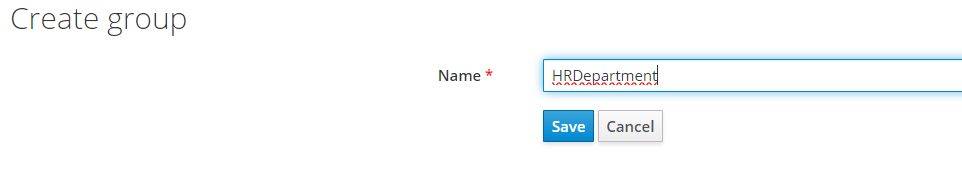

# How to launch project

## Preparations
Install docker machine on your local machine using one of proposed guide by this link: https://docs.docker.com/engine/install/ <p>
Download Postman using this link: https://www.postman.com/downloads/

## Launch project
Go to root directory of project in terminal/command line and execute this command
```bash
docker-compose up --build
```
It will pull Keycloak and two Postgres images, build image of project and run it simultaneously in container.
App will be running on 8081 port and Keycloak on 8080.

## Working with project

### Configuring Keycloak

#### Step 1. Logging into Keycloak
Go by this link http://localhost:8080/auth/ to Keycloak console<p>
<p>

Click `Administration Console` and you will be redirected to login page<p>
<p>

Admin user is already predefined, so enter: <p>
`Username: admin` <p>
`Password: admin` <p>

#### Step 2. Create Keycloak realm
On left side menu, hover over `Master` realm and click `Add realm` <p>
<p>

Enter name of realm and verify that `Enabled` is `On` <p>
 <p>
After this you will be redirected to your realm page.<p>
You should see at the top of menu name of your realm.<p>
<p>
#### Step 3. Create and configure client
Go to `Clients` page. Look for button at menu. You will be redirected, and you will see base clients.<p>
 <p>
Click Create button and fill `ClientID` field and click `Save`. <p>
 <p>
After this you will be redirected to your client page. <p>
Verify that `Enabled`, `Standard Flow Enabled`, `Direct Access Grants Enabled` and `Backchannel Logout Session Required` are turned on.  
All other sliders are disabled. <p>
Change `Client Protocol` to `openid-connect` and `Access Type` to `confidential`. <p>
Into `Valid Redirect URIs` enter URI that will handle URI for accessing code for token and click `+` to add it.<p>
Into `Web Origins` enter URI of your service and click `+` to add it.<p>
Complete configuration looks like this.<p>
<p>
<p>
After configuration click `Save`.
#### Step 4. Create new role
To create new role go to `Roles` tab and click `Add Role` button.<p>
<p>
Enter role name and some description and click save. <p>
 <p>
#### Step 5. Create and configure User
Go to `Users` tab and click `Add user` button. Enter `Username` and all other information that you want and click `Save`.<p>
<p>
Go to `Credentials` tab and define `Password`. I propose to set `Temporary` slider to Off to prevent redefining password. 
Click Set Password button and agree in popup window<p>
 <p>
After this password is set up successfully. If you see after creation that fields are empty and `Temporary` is On, it's completely fine.<p>
 <p>
Go to `Role Mappings `tab. <p>
<p>
Click on your role and click `Add selected`. <p>
 <p>

#### Step 6. Configure Custom Attributes
Go to `Users`, select your user, click `Attributes` tab.<p>
 <p>
Here you will define custom attribute.<p>
Enter key name department, value for it and click `Add`. Enter one of this `HR, Sales, Marketing, Finance, IT` to work with predefined data.<p>
<p>
Click Save to complete adding attribute. <p>
Go to `Clients` and select your client, click `Mappers` and `Create button`.<p>
In `Mapper Type` select `User Attribute`. Enter any mapper name. 
In `User Attribute` and `Token Claim Name` enter name of attribute that you have define previously for your user.
Switch off all sliders except of `Add to access token` and click `Save`<p>
<p>

#### Step 7. Acquire Access Token
Run Postman program, import collection using this link:
https://api.postman.com/collections/15826172-a989b383-a314-4aed-9990-56674dac1887?access_key=PMAT-01H7W1HH74ED4XJQ50NJ7DTJE7
and you can start testing application using existing collection. <p>

`OAuthn2 token` folder commands are responsible for acquiring access token
`Service` folder commands are responsible for requests to Spring Boot app.

Firstly go to `Get code` request and change in URI fields:
* `realm` - name of your realm
* `client_id` - name of your client
* `redirect_uri` - redirect URI that you defined in client config

In `Get access token` request change all from previous and additionally `client_secret`.<p>
Go to your realm -> Client -> Credentials and copy value in `Secret` field. If it is hidden click `Regenerate Secret`. <p>
Also you can define your personal `state` value.<p>

Now you can try to log in into using user that you have created.
To acquire token you need to copy `Get code` request, paste to you browser and perform Sign In process in Keycloak server.

Then after successful sign in, copy `code` part from URL.
Paste copied part into `Get access token` request and execute it in Postman.
In response, you will see data about access token that you have acquired.
If you got response with `access_token` field, you have logged in successfully.

