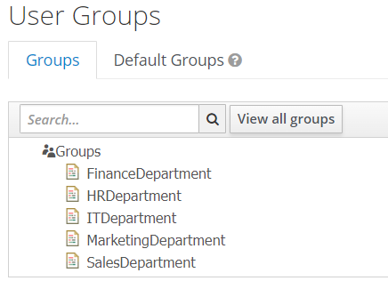
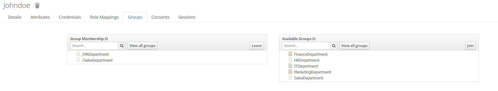

# Task 4 Groups config 
## Configuring Keycloak
### Step 1. Create groups

Go to `Groups` tab located in left menu under `Manage` block. Click new and type name of group. 

Name can be any, but for app we need to define it with this name format. `Name of department`Department. 
Create groups for all department names. here is the list of supported departments: `HR, Sales, Marketing, Finance, IT`. 
After creating return to `Groups` tab, and you should see all your Groups. 

### Step 2. Create groups mapping
To add groups to the JWT token body you need to create mapping as for department. 
Go to `Clients` -> `your-client` -> `Mappers` and click `Create`. 
Enter name `departmentMapper` and select in `Mapper Type` value `Groups membership`. Enter `Token Claim Name` value `departments`. 
Value in `Token Claim Name` defines under what name in JWT token group mappings will be stored.  
Do these configs for slider:
- Full group path - OFF. Don`t need for this app as we are interested only in group name. 
- Add to ID token - ON.
- Add to access token - ON.
- Add to userinfo - OFF.
- 

### Step 3. Add groups to user
Go to `Users` -> `View all users` -> select your user -> `Groups`.  

In right column select group and click `Join`.  
Department will be assigned to user, and you will see it in right column.  
Add several of them, but not all. Two will be fine.  

### Step 4. Verify that groups are added to JWT token.
Perform logging with configured user and acquire token. Go to https://jwt.io/ and pass it to `Encoded` column.  
If all was configured correctly you will see `departments` key and added to user groups.  

## Update Spring Boot App
In Spring Boot App manager user should see employees from departments that are related to defined for manager groups of departments.  
Example: Manager user have groups `HRDepartment` and `SalesDepartment`. After performing request user should see all employees that have department `HR` or `Sales`.  
To do this in code we will implement new endpoint and JPA function. Also, new function will be added to `SecurityContextHelper` class.  
You can do this by your own and use steps below as hits.

### Step 1. get groups from token.
To acquire `departments` values lets update `SecurityContextHelper` class.  

     public static List<String> getDepartments() {
        final var jwtAuthenticationContext = SecurityContextHolder.getContext().getAuthentication();
        final var credentials = (Jwt)jwtAuthenticationContext.getCredentials();
        final var groups = (List<String>) credentials.getClaims().get("departments");

        return groups
                .stream()
                .map(group ->
                        group
                        .replace("Department", "")
                        .trim()
                )
                .toList();
    }
As you can see groups is retrieved from token by `departments` key. Note that value is array, as user can have multiply departments defined.  
After retrieving we transform each group name from token to expected and returns it as list.  

### Step 2. Add new endpoint and processing for it.
After configuring retrieving of departments, we can proceed with new endpoint implementation.  
Firstly, we will update `EmployeeJpa` class to consume employees by departments.  

    @Query("SELECT e FROM Employee e WHERE e.employeeDepartment IN :departments")
    List<Employee> findAllByEmployeeDepartment(@Param("departments") List<String> departments);

As you can see in this DML employee is retrieved if his department matching one of defined in `departments` list value.  

The second part will be adding new logic to `EmployeeService` class.  

    public List<Employee> getEmployeesByDepartments() {
        return employeeJpa.findAllByEmployeeDepartment(SecurityContextHelper.getDepartments());
    }
Here we call retrieving function of database and get departments from `SecurityContextHelper`.  

And finally, add new endpoint to `EmployeeController` class.  

    @GetMapping("/search/department")
    public List<Employee> getEmployeesByDepartments() {
        return employeeService.getEmployeesByDepartments();
    }
To distinguish endpoints new subdirectory was added.  

### Step 3. Update Web Security config
Currently, if you try to call new endpoint from Postman you will get `Unauthorized 401` error.  
To avoid this we need to update `WebSecurity` class configuration. We need to define that there is access to new endpoint and only manager can access it.  
Add new endpoint path to existing `requestMatchers` for manager 
    
    .requestMatchers("/employees/search", "/employees/search/departments")
    .hasAnyRole("manager")

or add new configuration step

    .requestMatchers("/employees/search/departments")
    .hasAnyRole("manager")

After this you should be able to perform request from Postman to you new endpoint.  
### Step 4. Testing with Postman
Go to Postman, acquire token and perform `Get All Employees By departments` request. 
You should see list of employees from departments that are defined in manager user departments. See example below. 

