# Task 1 Configure Keycloak
## Configuring Keycloak
### Step 1. Logging into Keycloak
Go by this link http://localhost:8080/auth/ to Keycloak console 
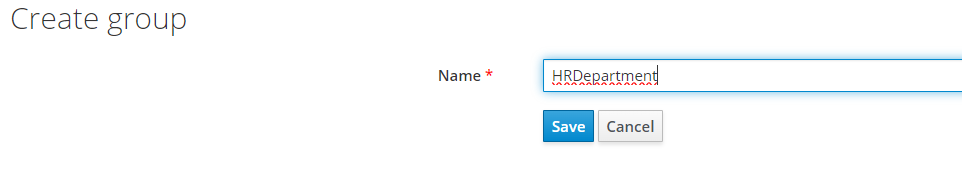 

Click `Administration Console` and you will be redirected to login page 
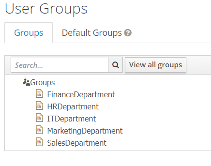 

Admin user is already predefined, so enter:  
`Username: admin`  
`Password: admin`  

### Step 2. Create Keycloak realm
On left side menu, hover over `Master` realm and click `Add realm`  
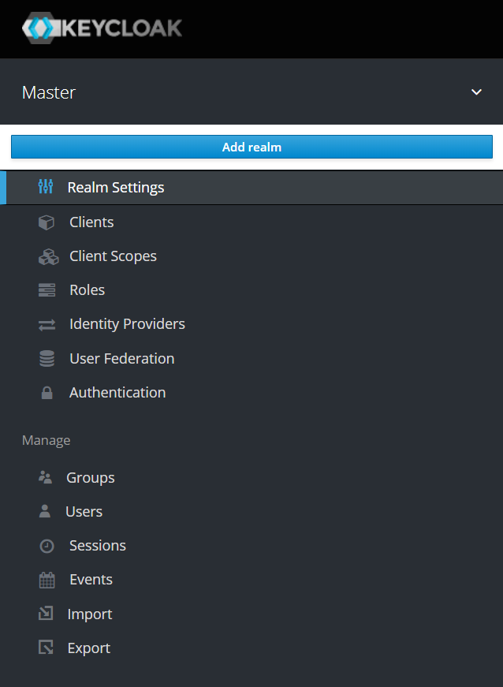 

Enter name of realm and verify that `Enabled` is `On`  
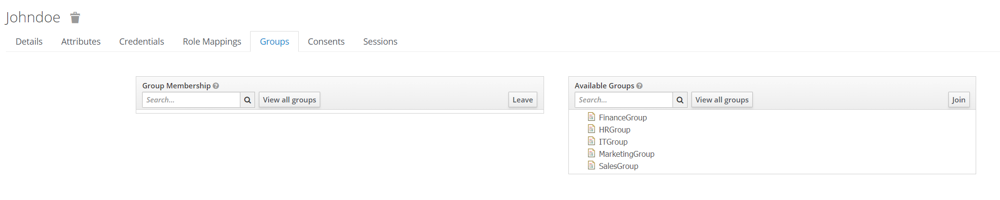  
After this you will be redirected to your realm page. 
You should see at the top of menu name of your realm. 
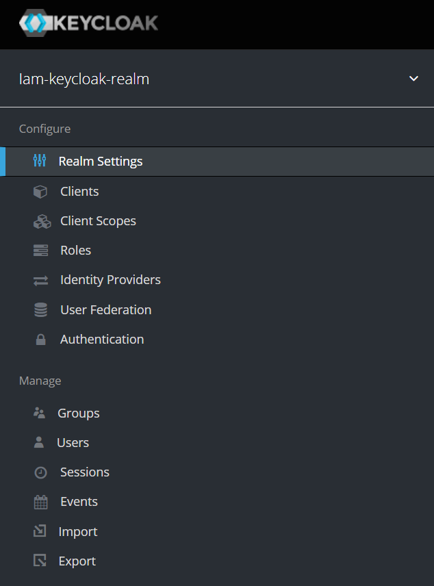 
### Step 3. Create and configure client
Go to `Clients` page. Look for button at menu. You will be redirected, and you will see base clients. 
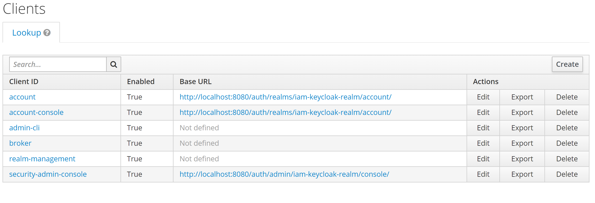  
Click Create button and fill `ClientID` field and click `Save`.  
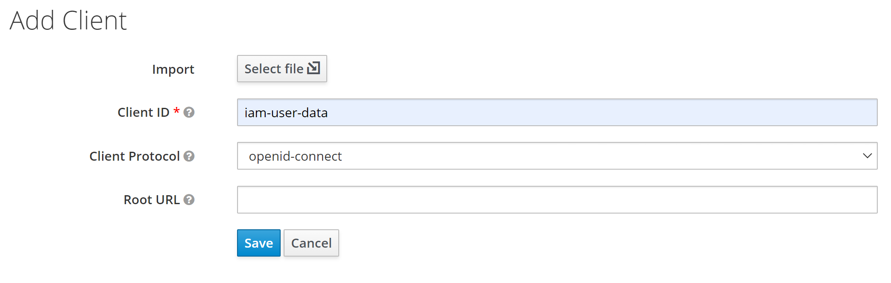  
After this you will be redirected to your client page.  
Verify that `Enabled`, `Standard Flow Enabled`, `Direct Access Grants Enabled` and `Backchannel Logout Session Required` are turned on.  
All other sliders are disabled.  
Change `Client Protocol` to `openid-connect` and `Access Type` to `confidential`.  
Into `Valid Redirect URIs` enter URI that will handle URI for accessing code for token and click `+` to add it.
For valid redirect URI use application port `8081` and unused endpoints as  `/callback`. 
Into `Web Origins` enter URI of your service and click `+` to add it. 
Complete configuration looks like this. 
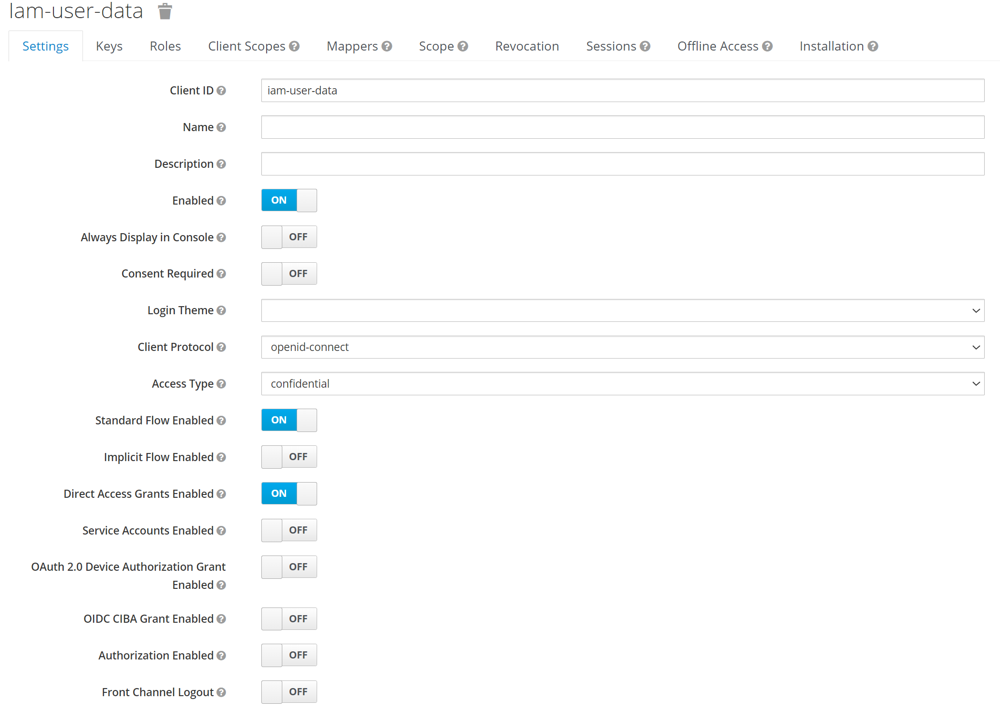 
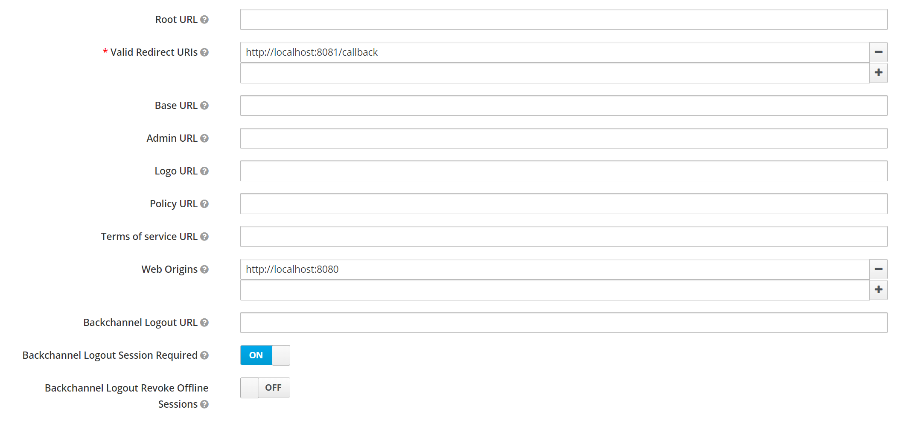 
After configuration click `Save`.
### Step 4. Create new role
To create new role go to `Roles` tab and click `Add Role` button. 
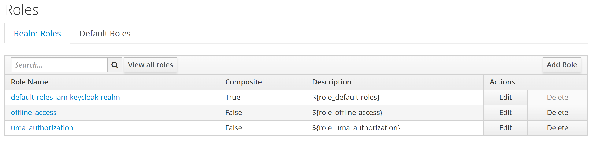 
Enter role name and some description and click save.  
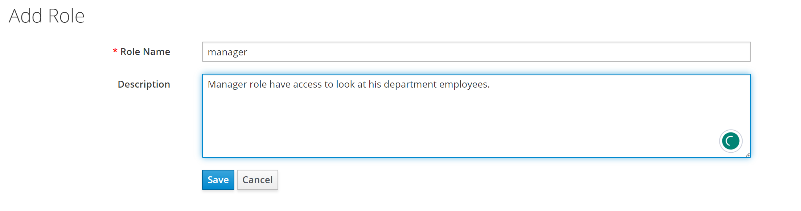  
### Step 5. Create and configure User
Go to `Users` tab and click `Add user` button. Enter `Username` and all other information that you want and click `Save`. 
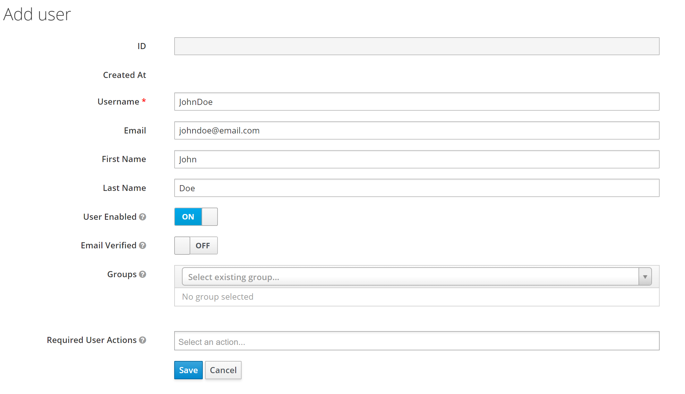 
Go to `Credentials` tab and define `Password`. I propose to set `Temporary` slider to Off to prevent redefining password.
Click Set Password button and agree in popup window 
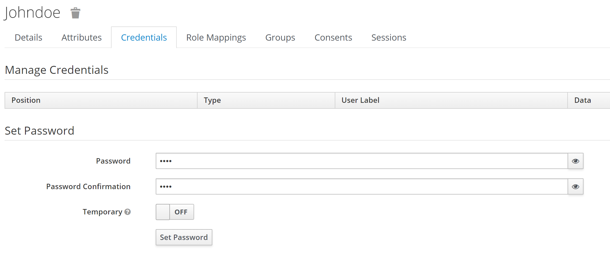  
After this password is set up successfully. If you see after creation that fields are empty and `Temporary` is On, it's completely fine. 
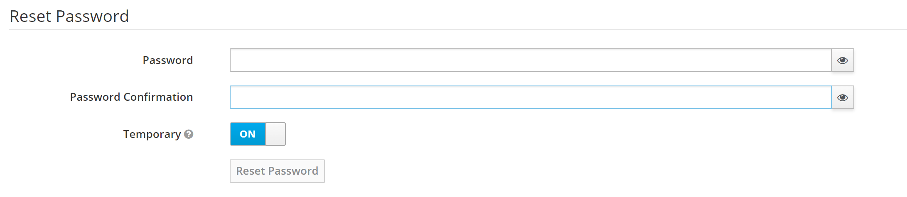  
Go to `Role Mappings `tab.  
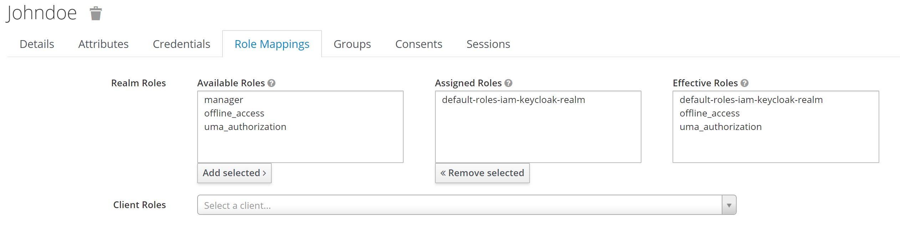 
Click on your role and click `Add selected`.  
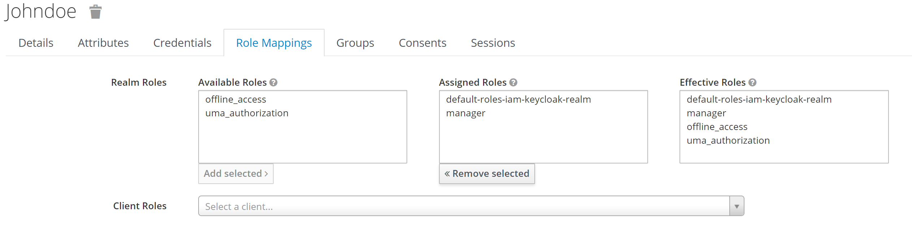  

### Step 6. Configure Custom Attributes
Go to `Users`, select your user, click `Attributes` tab. 
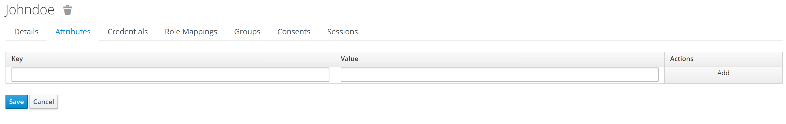  
Here you will define custom attribute. 
Enter key name department, value for it and click `Add`. Enter one of this `HR, Sales, Marketing, Finance, IT` to work with predefined data. 
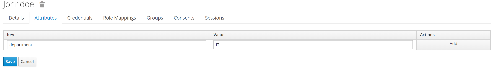 
Click Save to complete adding attribute.  
Go to `Clients` and select your client, click `Mappers` and `Create button`. 
In `Mapper Type` select `User Attribute`. Enter any mapper name.
In `User Attribute` and `Token Claim Name` enter name of attribute that you have define previously for your user.
Switch off all sliders except of `Add to access token` and click `Save` 
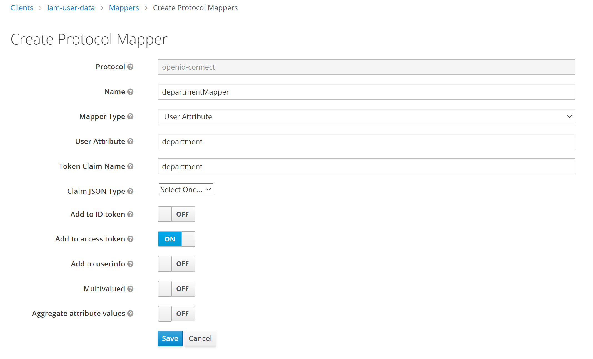 

### Step 7. Acquire Access Token
Run Postman program, import collection using this link:
https://api.postman.com/collections/15826172-a989b383-a314-4aed-9990-56674dac1887?access_key=PMAT-01H7W1HH74ED4XJQ50NJ7DTJE7
and you can start testing application using existing collection.  

`OAuthn2 token` folder commands are responsible for acquiring access token
`Service` folder commands are responsible for requests to Spring Boot app.

Firstly go to `Get code` request and change in URI fields:
* `realm` - name of your realm
* `client_id` - name of your client
* `redirect_uri` - redirect URI that you defined in client config

In `Get access token` request change all from previous and additionally `client_secret`. 
Go to your realm -> Client -> Credentials and copy value in `Secret` field. If it is hidden click `Regenerate Secret`.  
Also you can define your personal `state` value. 

Now you can try to log in into using user that you have created.
To acquire token you need to copy `Get code` request, paste to you browser and perform Sign In process in Keycloak server.

Then after successful sign in, copy `code` part from URL.
Paste copied part into `Get access token` request and execute it in Postman.
In response, you will see data about access token that you have acquired.
If you got response with `access_token` field, you have logged in successfully.